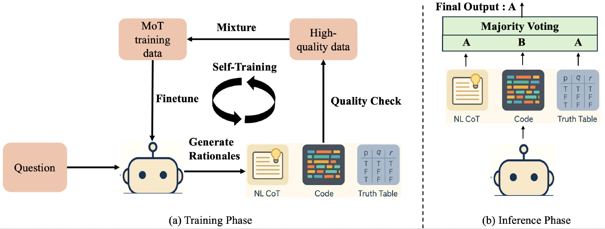

# Mixture-of-Thought (MoT) for Logical Reasoning


**Learning to Reason via Mixture-of-Thought for Logical Reasoning**  
Tong Zheng*, Lichang Chen*, Simeng Han, R. Thomas McCoy, Heng Huang  
_* These authors contributed equally_

This repository contains code and scripts for the Mixture-of-Thought (MoT) framework, which combines natural-language CoT, code-based CoT, and symbolic truth-table CoT in a self-evolving training loop and a voting-based inference strategy to improve performance on logical reasoning benchmarks (FOLIO, ProofWriter).

---

## 🔥 Key Features

- **Self-Evolving MoT Training**  
  - Multi-round fine-tuning: generate reasoning traces in three modalities, filter and verify them, then fine-tune for the next round.  
- **Mixture-of-Thought Inference**  
  - Simultaneously run NL-CoT, Code-CoT, and Truth-Table-CoT, then fuse answers by majority vote.  
- **Truth-Table-CoT**  
  - Identifies Variables, constructs partial truth table where each row does not conflict with premises, and checks conclusion consistency across surviving rows.  
- **Reproducible & Extensible**  
  - Tested with Gemma-2-2B-It, Gemma-2-9B-It, Qwen-2.5-7B-Instruct, and easily adaptable to other LLMs.

---

## 🔥 Our MoT Framework



*Figure: Overview of the Mixture-of-Thought (MoT) framework combining NL-CoT, Code-CoT, and Truth-Table-CoT in a self-evolving training loop and voting-based inference.*


---

## 🔥 Main Results

| Model                             | Method Type           | Reasoning Modality   | FOLIO (%) | ProofWriter (%) | Avg (%) |
|-----------------------------------|-----------------------|----------------------|-----------|-----------------|---------|
| **Prior SOTA: GPT-4 (Logic-LM)**  | Logic-LM              | -                    | 78.9      | 79.7            | 79.3    |
| **Prior SOTA: GPT-4 (CoT)**       | CoT (Vanilla)         | -                    | 70.6      | 68.1            | 69.4    |
|                                   |                       |                      |           |                 |         |
| **Gemma-2-2B-It (3-Shot)**        | Single-Thought        | Best (nl)            | 42.4      | 39.8            | 41.1    |
| Gemma-2-2B-It @3 (3-Shot)         | Single-Thought        | Best (nl)            | 45.3      | 38.8            | 42.1    |
| **MoT (0-Shot)**                  | Single-Thought        | Best                 | 61.1      | 62.7            | 61.9    |
| **MoT (0-Shot)**                  | Mixture-of-Thought    | All                  | **62.6**  | **65.0**        | **63.8**|
|                                   |                       |                      |           |                 |         |
| **Gemma-2-9B-It (3-Shot)**        | Single-Thought        | Best (nl)            | 69.5      | 61.2            | 65.4    |
| Gemma-2-9B-It @3 (3-Shot)         | Single-Thought        | Best (nl)            | 72.9      | 62.7            | 67.8    |
| **MoT (0-Shot)**                  | Single-Thought        | Best                 | 76.9      | 69.5            | 73.2    |
| **MoT (0-Shot)**                  | Mixture-of-Thought    | All                  | **78.9**  | **70.7**        | **74.8**|
|                                   |                       |                      |           |                 |         |
| **Qwen2.5-7B-Instruct (3-Shot)**  | Single-Thought        | Best (nl)            | 71.9      | 60.5            | 66.2    |
| Qwen2.5-7B-Instruct @3 (3-Shot)   | Single-Thought        | Best (nl)            | 73.4      | 65.8            | 69.6    |
| **MoT (0-Shot)**                  | Single-Thought        | Best                 | 75.9      | 69.2            | 72.6    |
| **MoT (0-Shot)**                  | Mixture-of-Thought    | All                  | **78.3**  | **71.8**        | **75.1**|


## 🚀 Quick Start

### 1. Environment Setup

```bash
# Create and activate a conda environment
conda env create -f environment.yml
```

### 2. Self-evolving Mixture-of-Thought Training

```bash
# Self-evolving Training with on Policy 
bash scripts/star_pipeline_final_on_policy.sh (On Policy)

# Self-evolving Mixture-of-Thought Training with on Policy 
bash scripts/mix_training_gemma_2_9b.sh (On Policy)

# Self-evolving Mixture-of-Thought Training with off Policy 
bash scripts/mix_training_gemma_2_9b_offp.sh (Off Policy)
```

### 3. Mixture-of-Thought Inference

```bash
# Inference with each thought paradigm 
bash scripts/eval.sh # set MODE="nl"
bash scripts/eval.sh # set MODE="truth_table"
bash scripts/eval.sh # set MODE="code"

# Majority Vote
python analysis/hard_vote.py [file_1] [file_2] [file_3] 
```

### 4. Experiments: Mixture-of-Thought Sampling vs. Single-thought Sampling

```bash
# Sample 128 outputs for each thought paradigms and each model (baseline and our MoT model)
bash scripts/budget_experiments/eval.sh

# Perform Mixture-of-Thought sampling and Single-thought Sampling from these outputs
python budget_experiment/eval_test_time_scaling_vote.py (if you want to plot accuracy curve)

python budget_experiment/eval_test_time_scaling.py (if you want to plot pass@k curve)
```


### 5. Experiments: Performance across Problem Difficulties

```bash
# Single Thought for FOLIO (Hint: you do not need to run this on ProverQA as they have provide separate subset with different difficulties)
python difficulty_experiments/eval_by_difficulty.py --prediction_path [prediction_path] --easy_dataset_name [easy_dataset_name] --difficult_dataset_name [difficult_dataset_name]

# Mixture-of-Thought for FOLIO
python difficulty_experiments/eval_vote_by_difficulty.py --nl_path [nl_path] --code_path [code_path] --tt_path [tt_path] --easy_dataset_name [easy_dataset_name] --difficult_dataset_name [difficult_dataset_name]
```

### 6. Complementarity & Uniqueness Analysis

```bash
cd analysis

python analysis_overlap.py [file_1] [file_2] [file_3]

# The files file_1, file_2, and file_3 contain the inference outputs for each reasoning paradigm and can be generated using our evaluation scripts.
```

## 📖 Citation

If you use this code or the MoT methodology, please cite:

```bibtex
@inproceedings{zheng2025mot,
  title     = {Learning to Reason via Mixture-of-Thought for Logical Reasoning},
  author    = {Zheng, Tong and Chen, Lichang and Han, Simeng and McCoy, R. Thomas and Huang, Heng},
  year      = {2025}
}
```